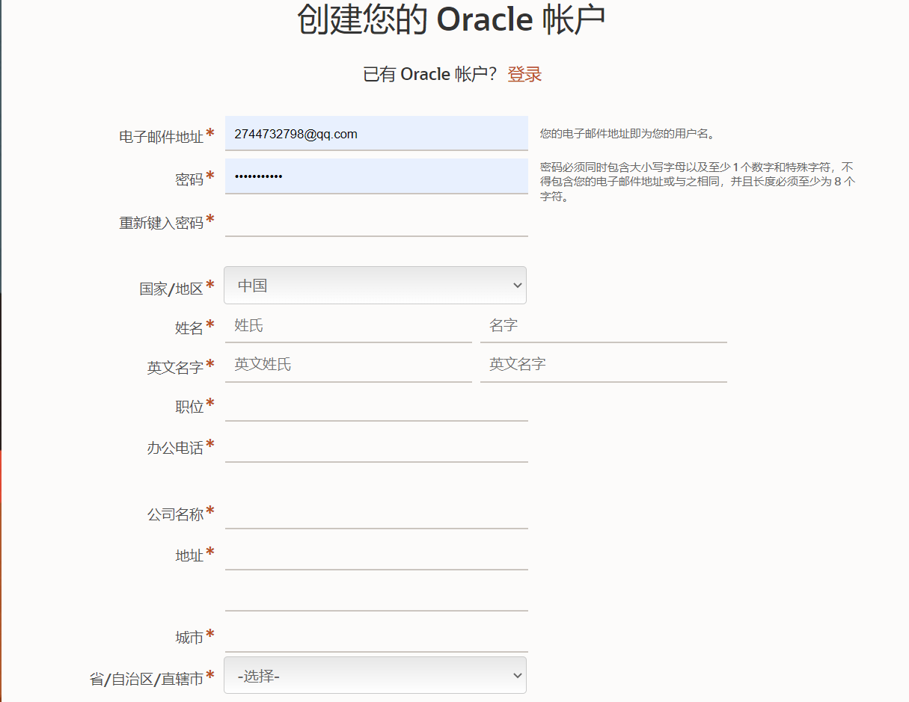
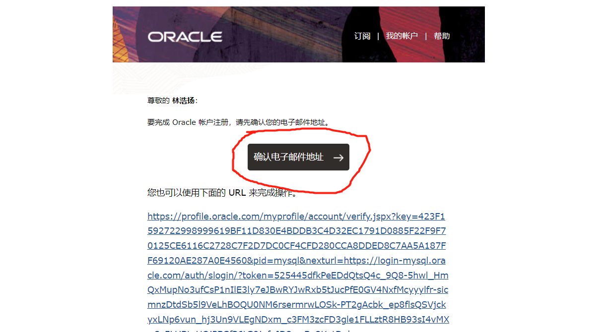
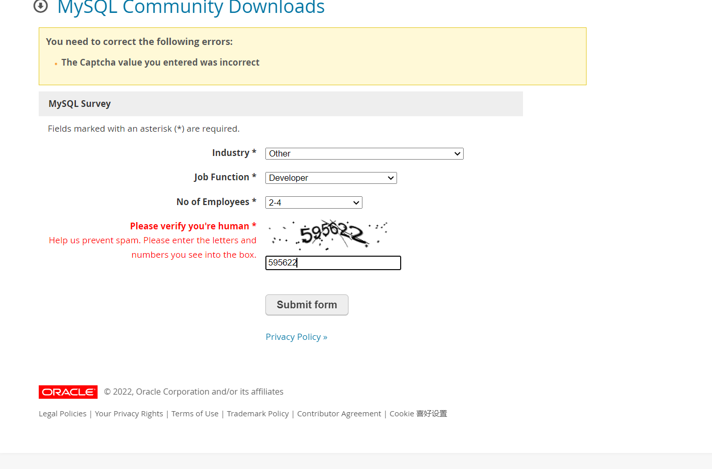
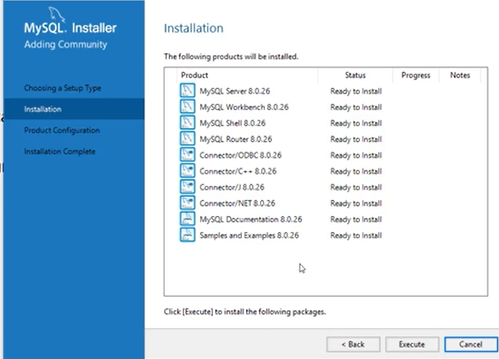
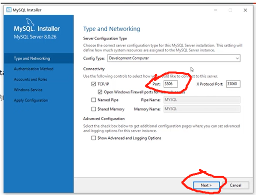

<h1 align="center">数据库认识和下载</h1>

### 数据库认识

|                     |                                      |      |
| ------------------- | ------------------------------------ | ---- |
| **数据库**          | 储存数据的仓库，数据有组织的进行存储 | DB   |
| **数据库管理系统 ** | 操纵和管理数据库的软件(例如MySQL等)  | DBMS |
| **SQL编程语言**     | 用来操作关系型数据库的一套标准       | SQL  |

***注 :SQL并非直接操作数据库，而是用来操作数据库管理系统，让数据管理系统操作数据库。***

### 关系型数据库

概念：建立在关系型模型基础上，由多张相互连接的二维表组成的数据库。 

即是用一张或者多张表格创建的数据库 : 相当于excel表格的数据之间的关系（表头和内容一一对应）。

（  格式统一，便于维护，用SQL操作方便   ）

<table><tr><th>id</th><th>name</th></tr><tr><td>520</td><td>xzy</td></tr></table>

### MySQL数据库下载

### 注意:

**如果你之前下载过类似于wampserver之类的集成开发环境。(包括mYSQL的)，可以选择不下载，直接使用这一类的集成开发环境。 **

- 下载地址: <a href="https//dev.mysql.com/downloads/windows/installer">https//dev.mysql.com/downloads/windows/installer</a>

- 点击 **sign up（注册）** 弹出以下界面:

- 注册完后 会向邮箱发送通知 ；在邮箱中点击确认

- 登录:此时会弹出要你提交表格:

  

- 点击提交后，再点击 **Download Now**> 进行下载

- 下载完毕后 打开所下载的文件 然后一直点击next 。

- 点击第二次 next后 会弹框提示。 不用管他，点击yes。到这个页面后选择右下角的Execute 。等待全部下载完成后点击next。

- 如果这个next没有高亮显示 即无法点击。并且port上面有个警示符。这代表你之前已经下载过mYSQL。默认端口被占用。此时选择卸载以前所下载过的mYSQL。再打开即完成。（如果是类似于wampserver等集成开发环境，不建议卸载，而直接使用自带的mYSQL即可。）

  一直点击next。

- 到达设定密码账户的页面。设置123456 或者你自己记住的账号密码。一直点击next，再点击 Execute即可。
