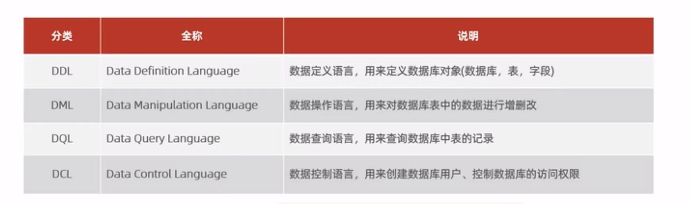
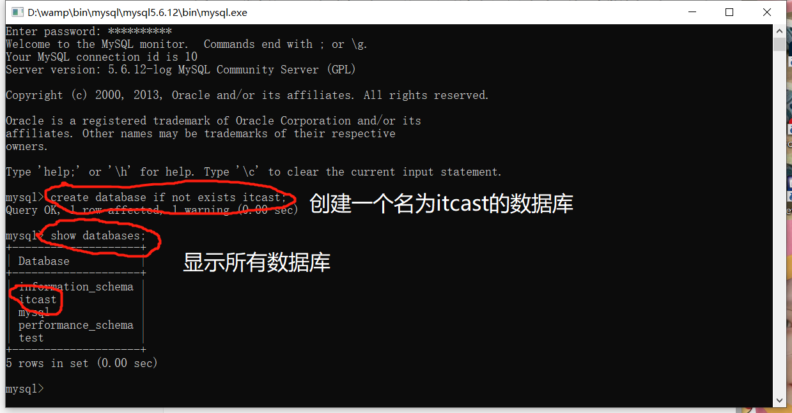
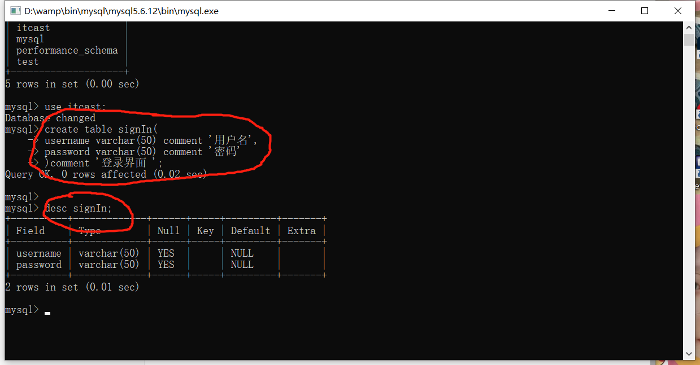

<h1 align="center">SQL--DDL学习</h1>

### 注意： 

- SQL可以使用空格和tab，但是必须以分号结尾。；
- 并且SQL不区分大小写。（最好关键字用大写）；
- 单行注释： --注释内容 或者 # 注释内容（MySQL特有）

​	   多行注释：/*  注释内容  */；

- 所有的代码都是 英文字符  。不可以用中文字符否则会报错。

### SQL分类：




### DDL语句:

**注意：[ ] 里面的可以加或者不加  。**

**所用的每句话必须加上；(分号)结尾当做结束语句。否则无法判定是否结束  。**

**每写完一个单词要加空格与后面单词隔开  **


## 1数据库操作

### 查询  

<table><tr><th>查询所有数据库</th><th>查询当前数据库</th></tr><tr><td> show databases </td><td>select database() </td></tr></table>


### 创建  

- `create databases [IF NOT EXIST] 数据库名 [DEFAULT CHAREST字符集] [ COLIATE 排序规则]`

( IF NOT EXIST 表示 如果没有 ：create database if not exist iteam； 表示如果数据库里面没有名为iteam的数据库则创建一个名为iteam的数据库 )

( 创建名字的数据库必须与已有的数据库名不重复，否则会报错 ，除非在数据库名前面加上 if not exist)



### 删除  

- `drop database[IF EXISTS]数据库名`

（ IF EXIST表示 如果有 ）

### 使用  

- `use 数据库名  `

（可以用select database() 来查询当前使用的数据库）


## 2 表操作


注：1.comment 后面加注释

​		2.字段类型 可以是 int 表示整数型 

​		也可以是decimal 表示精确的小数

​		也可以是 varchar(50) 字符型 (括号里面加的数字代表多少个字符  比如xzy 为 3个字符)

​		也可以是date 表示精确到年月日的时间

### 表创建

```sql
create table 表名(

字段1  字段1的类型 [ comment   ‘  字段1的注释   ’],     --以逗号结尾不是以分号结尾哈!

...

字段n  字段n的类型[ comment   ‘  字段n的注释 ’]       --最后一个字段后面不用加逗号结尾

)[comment 表注释] ;                                              --加；结尾结束语句
```


### 表查询

<table><tr><th>查询当前数据库所有的表</th><th>查询指定的表结构</th><th>查询指定表的建表语句</th></th></tr><tr><td>show tables</td><td>desc 表名字 </td><td>show create table 表名字</td></tr></table> 



#### 数据类型

char (10)定长字符串（性能好）

varchar(10)变长字符串（性能差）

char(10)表示存储了十个字符型，不够用空格补（用在已知字符数量，比如性别sex 只有一个字符男或者女）

而varchar(10)不会，会依据输入的多少来表示存储多少位（用在输入多位字符）


#### 案例

设置一张员工信息表：

- 包括编号（纯数字），
- 员工工号（字符串类型不超10位），
- 员工姓名（字符串类型不超10位），
- 性别（男/女）
- 身份证号（18位）
- 入职时间（取值年月日）


```sql
create table emp(
	id int comment'编号',
    workId varchar(10) comment'员工工号',
    workName varchar(10) comment'员工姓名',
    sex char(1) comment'性别',
    idCard char(18) comment'身份证号',
    entryDate date comment'入职时间'
)comment'员工表';
```


### 表修改

#### 添加属性

`alter table 表名字 add 字段名 类型  [comment '注释'][约束]`  

#### 案例：

往emp表添加一个nickname

`alter table add emp nickname varchar(10) [comment'小名']；`


#### 修改数据类型

`alter table 表名 modify 字段名 新数据类型(长度)`;


#### 修改字段名和字段类型

`alter 表名 change 旧字段名 新字段名 类型(长度) [comment注释][约束];`

#### 删除字段

`alter table 表名 drop 字段名;`

#### 修改表名

`alter table 表名 rename to 新表名;`


### 删除表

- 直接删除表（全部删除）

`drop table[if exist] 表名;`

- 清空表里面的内容（表名还在）

`tyuncate table 表名;`


## 附加:


`select distinct workName 员工姓名 from emp;`


