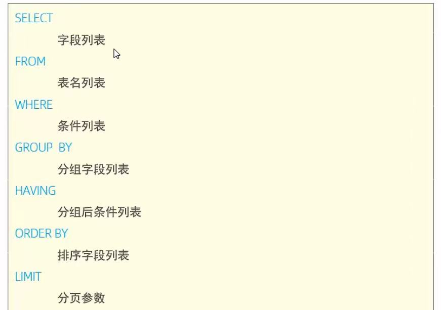
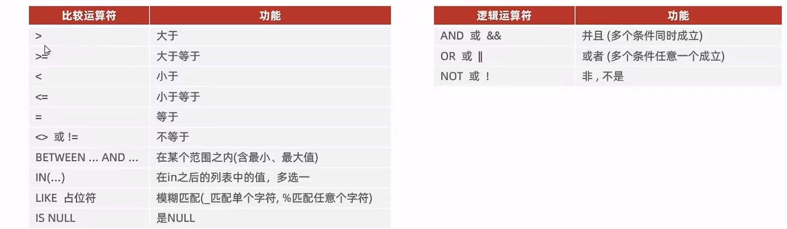
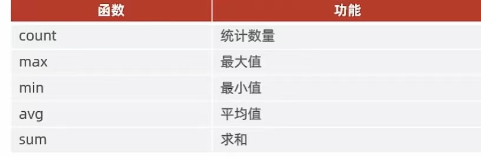
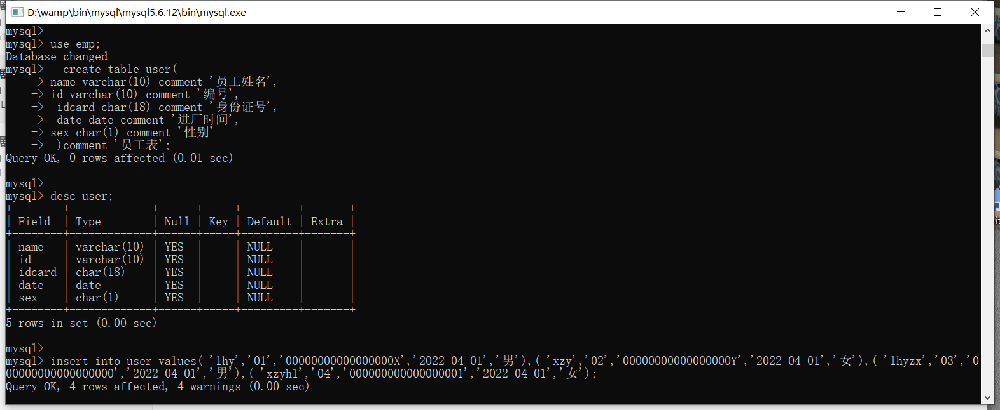
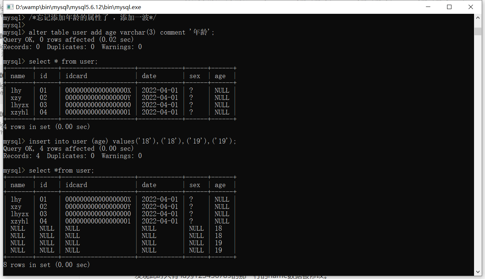
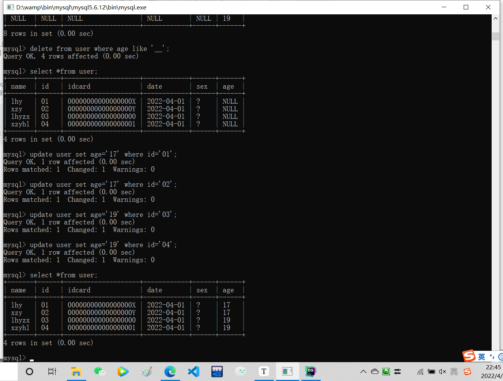
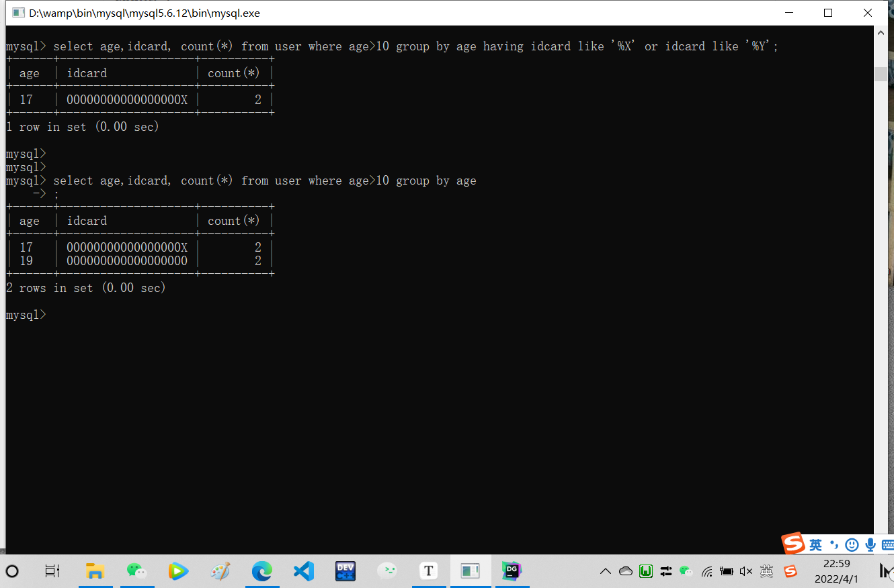

<h1 align="center">SQL-DQL</h1>

### 代码写的 user是一个 表名 ，数据每一行代表一个员工，员工有name，id，idcard，date，sex等属性：

### DQL-基本查询

#### 注：

- 字段列表表示   字段1,字段2，字段3...  

- 字段代表属性名
-  [ “ ” ] 的方括号 代表可以加或者不用加 ； [ ]  不用加进代码段。

#### 查询多个字段

` select 字段1,字段2... from 表名;`

( 这里表示返回 指定字段 的内容 )

` select * from 表名;`

( * 这里表示返货全部字段的数据内容  ，尽量不要使用，影响开发效率。)

#### 设置别名

` select 字段1 [as 别名1],字段2[as 别名2 ]... from 表名;`

（ 这里的 as 可以不用加 ）

#### 去除重复记录

` select distinct 字段列表 from 表名 ;`

(查询的内容不重复)

#### 案例：

不重复查询 user的 所有数据表格：

`select distinct * from user;`

### DQL-条件查询

#### 语法：

 ` select 字段列表 from 表名 where 条件列表 ;`

#### 案例：

- 查询 表名为 user 的 id = “ 01” 的 所有员工：

` select * from user where id="01";`

- 查询 没有身份证号的 所有员工：

` select * from user where is NULL ;`           ( 有身份证号的就是 ` NOT is NULL`)

- 查询 age 在 15到20的所有员工：

` select * from user where between 15 and 20; `        ( 注意：15 和20 对调会报错)

- **重：查询名字占2个字大小的所有员工**：

` select * from user where name like '_ _';`      

（用两个 下划线 _ _ 代表 匹配俩个任意字符。 也可以 用ABC等字符代表匹配ABC等字符）

- **重：查询身份证号（18位）最后一个为 X 的所有员工：**

` select * from user where idcard like '%X';`      

  (% 实现模糊搜索 ， 不需要占位)或者：

`select * from user where idcard like '_________________X';`   ( 有17个 _  占位 再加一个X 代表搜索指定18位字符)

**注：会输出身份证号最后一位是X的员工的全部信息。**

### DQL-聚合函数

**介绍** ：将一列数据作为一个整体，进行纵向计算。

<h5 align="center">count &nbsp&nbsp max &nbsp&nbsp min &nbsp&nbsp avg &nbsp&nbsp sum</h5>

#### 语法：

` select 聚合函数（字段列表）from 表名;`

**注：所有的null不参与计算。**

#### 案例：

- 统计所有员工数量 ：

` select count(*) from user;`         或者：  ` select count(id) from user;`

#### 注意：

只有 count 统计员工 数量 括号里面 才可以加 * ，比如count(* )，其他函数不能括号里面 ***不可以是***   *。

比如avg(*) 不知道代表啥含义。

- 统计所有 男性 ( sex) 员工年龄( age )之和：

`select sum ( age ) from user where sex='男';`

**假设员工年龄之和为135 则查询后会输出：**

<table><tr><th>sum(*)</th></tr><tr><td>135</td></tr></table>

### DQL-分组查询

#### 语法：

`select 字段列表 from 表名 [ where 条件 ] group by 分组字段名 [ having 分组后过滤条件 ]；`

**注：where和having的区别**

- 执行时机不同：where先判断过滤 再分组；having先分组后过滤。
- 判断条件不同：where不能对聚合函数进行判断；having可以。

#### 案例：

- #### 1.按性别进行分组，统计男员工女员工数量：

` select sex,count( * ) from user group by sex;`

 **注：用 ，隔开。**

**解析： ** 假设有 7个男员工和 8 个女员工：

如果只是 	`select count( * ) from user group by sex;`    	则会输出：

<table><tr><th>count(*)</th></tr><tr><td>7</td></tr><tr><td>8</td></tr></table>

而加个，使俩个一起参与则会输出：

<table><tr><th>sex</th><th>count(*)</th></tr><tr><td>男</td><td>7</td></tr><tr><td>女</td><td>8</td></tr></table>

- #### 2.查询年龄小于18岁的员工，根据性别分组，并过滤身份证号最后一位不是 XY 。

` select sex, count(*) from user where age<18 group by sex having idcard like '%X' or idcard like '%Y'; `

### 案例：创建user并执行一些操作：

忘记添加年龄的属性了，添加一波：

插入年龄的数据出错，插到后面去了，删除并修改：

进行最后的操作：查询年龄小于18岁的员工，根据性别分组，并过滤身份证号最后一位不是 XY 。

( 好像额。。。识别不了中文的男女 我就改了一下)

可以看出俩个的区别吧！

### 可以知道 select 后面紧跟的 字段集 是分行的 依据 ！

### DQL-排序查询

将指定数据进行排序（只用于

#### 语法：

` select 字段列表 from 表名 order by 字段1 排序方式1，字段2 排序方式2;`

**排序方式**

- asc 升序  (默认值)   （ 1,2,3,4,5,6 ）
- desc 降序   (6,5,4,3,2,1)

