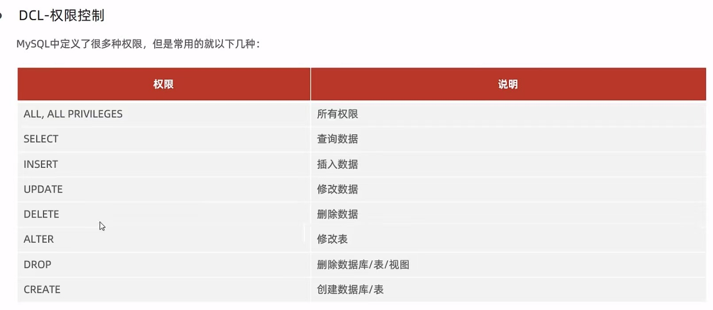

<h1 align="center">SQL-DCL</h1>

### **介绍：**

**用来管理数据库用户、控制数据库的访问权限。**


### DCL-管理用户

#### 1.查询用户：

```sql
use mysql;
select * from user;
```

**用户信息默认存储在mysql的user表中**


#### 2.创建用户：

`create user '用户名'@'主机名' identified '密码';`


**只能在本地主机访问localhost**

` create user 'itcast'@'localhost' identified by '123456';`

**如果想在任意主机访问，则用%**

` create user 'itcast'@'%' identified by '123456';`


#### 3.修改用户密码：

`alter user '用户名'@'主机名' identified with mysql_native_password by '新密码';`


#### 4.删除用户：

`drop user '用户名'@'主机名';`


### DCL-权限控制





- 1.查询权限

`show grants for '用户名'&|@'主机名';`


- 2.授予权限

`grant 权限列表 on 数据库名.表名 to '用户名'@'主机名';`


- 3.撤销权限

` remove 权限列表 on 数据库名.表名 from ' 用户名'@'主机名';`


